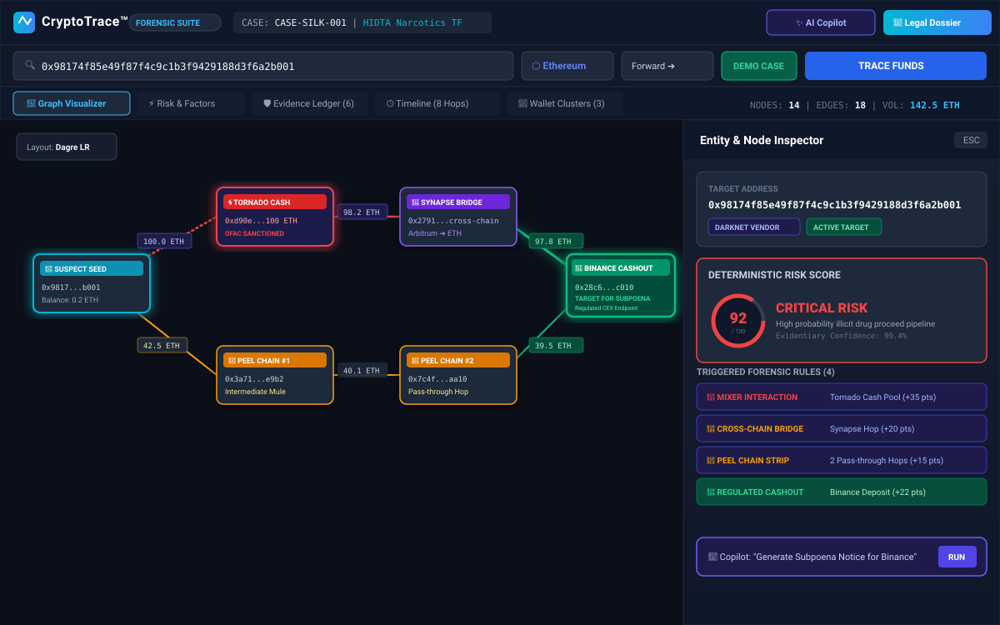
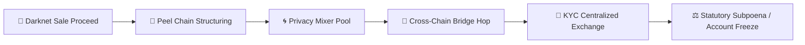
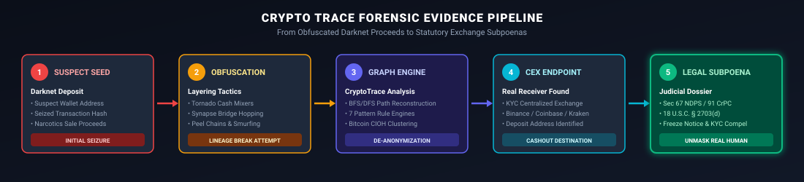
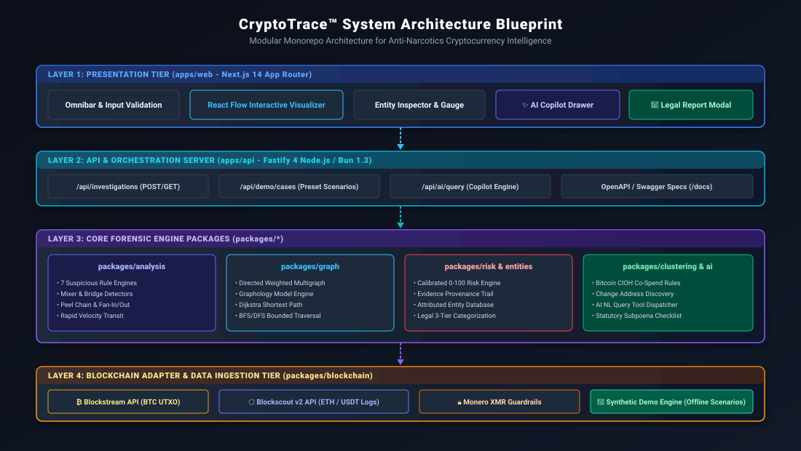

# CryptoTrace™ | Anti-Narcotics Cryptocurrency Forensic Tracing Platform

[](https://www.typescriptlang.org/)
[](https://bun.sh/)
[](https://nextjs.org/)
[](https://fastify.io/)
[](https://reactflow.dev/)
[](https://opensource.org/licenses/MIT)

**CryptoTrace™** is an enterprise-grade blockchain forensic intelligence and de-anonymization platform purpose-built for **Drug Law Enforcement Agencies (NCB, DEA, HIDTA, Special Task Forces)**. It enables law enforcement investigators to follow complex cryptocurrency transaction trails, penetrate multi-layered obfuscation techniques (privacy mixers, cross-chain bridges, peel chains, and smurfing operations), cluster laundering syndicates, and **unmask the real human receivers at KYC-regulated cashout endpoints**.

---

## 📌 Table of Contents
- [🖼️ Application Wireframe & UI Overview](#️-application-wireframe--ui-overview)
- [🎯 Problem Statement & Operational Objective](#-problem-statement--operational-objective)
- [🔄 Forensic Evidence Pipeline](#-forensic-evidence-pipeline)
- [🏗️ System Architecture](#️-system-architecture)
- [⚡ Key Capabilities & Feature Breakdown](#-key-capabilities--feature-breakdown)
- [🧪 Synthetic Demo Scenarios](#-synthetic-demo-scenarios)
- [🛠️ Technology Stack](#️-technology-stack)
- [🚀 Getting Started & Local Setup](#-getting-started--local-setup)
- [📡 REST API Documentation](#-rest-api-documentation)
- [🧪 Testing & Verification](#-testing--verification)
- [📂 Monorepo Repository Structure](#-monorepo-repository-structure)
- [⚖️ Statutory Evidentiary & Legal Framework](#️-statutory-evidentiary--legal-framework)

---

## 🖼️ Application Wireframe & UI Overview

Below is the product wireframe architecture of the **CryptoTrace™ Forensic Visualizer Workspace**, demonstrating the main investigation layout: Omnibar search, interactive graph visualizer with Dagre auto-layout, deterministic risk gauge, node inspector drawer, triggered rule factors, and AI Copilot assistant.



### Workspace UI Component Breakdown
| UI Component | Location | Description & Capabilities |
| :--- | :--- | :--- |
| **Investigation Header** | Top Bar | Displays active Case ID, agency designation, quick metrics, AI Copilot trigger, and one-click Statutory Subpoena Dossier generator. |
| **Omnibar Search & Controls** | Sub-Header | Multi-chain input resolver supporting EVM hex addresses, Bitcoin Base58/Bech32, transaction hashes, live/demo modes, max hop depths (1–10), and pre-loaded syndicate case files. |
| **Tab Navigation Bar** | Center Top | Toggle between **Graph Visualizer**, **Risk & Factors**, **Evidence Ledger**, **Transaction Timeline**, and **Wallet Clusters**. |
| **Graph Visualizer Canvas** | Left Workspace | Powered by React Flow with custom node types (Suspect Seed, Mixer Pool, Bridge Contract, Peel Chain Mule, KYC Cashout Endpoint). Includes animated currency value edges and automatic DAG layout. |
| **Entity & Risk Inspector Drawer** | Right Side | Displays selected node metadata, real-world entity attribution, 0–100 calibrated risk gauge, evidence provenance, and instant subpoena notice generation shortcuts. |
| **AI Copilot Drawer** | Slide-out Panel | Interactive forensic natural language assistant that parses investigator queries (e.g. *"Which exchange received the final payout?"*) and executes analytical graph tools. |

---

## 🎯 Problem Statement & Operational Objective

### Background & Narcotics Laundering Tactics
Cryptocurrencies (Bitcoin, USDT, Ethereum, Monero) are heavily exploited by narcotics trafficking organizations to collect Darknet vendor proceeds, fund precursor chemical purchases, and store illicit wealth.

### The Obfuscation Challenge
Traffickers avoid direct transfers to personal bank accounts, deploying sophisticated laundering techniques:
1. **Privacy Pools / Mixers**: Routing funds through OFAC-sanctioned smart contracts (*Tornado Cash, CoinJoin, ChipMixer*) to break transaction lineage.
2. **Cross-Chain Bridges**: Hopping across blockchains (*Synapse, Across, Stargate*) to disrupt single-chain block explorer tracking.
3. **Peel Chains & Smurfing**: Splitting transactions into hundreds of minor micro-transfers (*peel chains*) through unhosted mule wallets to strip gas fees and hide main balances.



### The CryptoTrace™ Solution
CryptoTrace™ provides **end-to-end de-anonymization**. It traces funds forward from suspect deposits or backward from seized transaction hashes to the **ultimate cashout endpoints (KYC-regulated Centralized Exchanges like Binance, Coinbase, Kraken, CoinDCX)**. It automatically constructs court-admissible forensic dossiers and statutory subpoena checklists (**Section 67 NDPS Act / Section 91 CrPC / 18 U.S.C. § 2703(d)**) to freeze accounts and compel exchange identity disclosures.

---

## 🔄 Forensic Evidence Pipeline

The diagram below details the 5-step operational workflow executed during an investigation:



1. **Suspect Seed / Deposit Seizure**: Input suspect wallet address or transaction hash seized from vendor devices.
2. **Obfuscation Layer Breakdown**: Automatically identify and flag privacy pool deposits, bridge hops, and pass-through mule wallets.
3. **Graph Analysis & Syndicate Clustering**: Run BFS/DFS bounded path finding, Dijkstra shortest-path algorithms, and Bitcoin Common-Input Ownership Heuristics (CIOH).
4. **CEX Endpoint Identification**: Highlight KYC-compliant exchange deposit addresses where fiat off-ramping occurs.
5. **Statutory Subpoena Generation**: Output a complete judicial report with exact block numbers, evidence IDs, and statutory legal demand forms.

---

## 🏗️ System Architecture

CryptoTrace™ is built as a modular monorepo containing application layers and isolated domain engine packages:



### Monorepo Architectural Layering

```
narabsdk/
├── apps/
│   ├── web/                    # Next.js 14 Web Visualizer (React Flow, Tailwind CSS, Lucide Icons)
│   └── api/                    # Fastify 4 REST API Server (OpenAPI/Swagger, Controllers)
├── packages/
│   ├── types/                  # Shared TypeScript Interfaces & Zod Validation Schemas
│   ├── blockchain/             # Bitcoin (Blockstream), Ethereum/USDT (Blockscout v2) & Demo Engine
│   ├── graph/                  # Directed Weighted Multi-Graph & Graphology Path Traversal Algorithms
│   ├── analysis/               # 7 Forensic Suspicious Pattern Detection Engines
│   ├── entities/               # Labeled Entity Database & Attribution Engine
│   ├── clustering/             # Bitcoin CIOH Co-Spend & Change Address Discovery Engine
│   ├── risk/                   # Deterministic 0–100 Risk Engine & Evidence Provenance Ledger
│   └── ai/                     # Natural Language Query Parser & Subpoena Report Generator
└── tests/                      # Comprehensive Unit & Integration Test Suites
```

---

## ⚡ Key Capabilities & Feature Breakdown

### 1. Dual Ingestion Modes
- **🔴 Live Mainnet Investigation**:
  - Live API scanning from public blockchain indexers (**Blockstream REST API** for Bitcoin, **Blockscout v2 API** for Ethereum & USDT).
  - Input validation for Bitcoin (Base58, Bech32), EVM Hex addresses, and 64/66-character transaction hashes.
  - Zero mock data fallback in live mode with strict API error boundaries.
- **🔵 Forensic Demo Scenarios**:
  - Pre-packaged offline syndicate case files for training and demonstration.

### 2. Multi-Asset Blockchain Engine
- **Bitcoin (BTC)**: Native UTXO graph parsing, multi-input co-spent clustering (CIOH), and change address detection.
- **Ethereum (ETH)**: Direct value transfers, internal contract call parsing, and ERC-20 log tracking.
- **Tether (USDT)**: Smart contract transfer event extraction with decimal formatting.
- **Monero (XMR)**: Privacy guardrail providing statutory notices and countermeasure recommendations.

### 3. Forensic Suspicious Pattern Engine (7 Rule Detectors)
1. **Mixer / Tumbler Interaction**: Flags interactions with OFAC-sanctioned contracts (Tornado Cash, Blender, ChipMixer).
2. **Cross-Chain Bridges**: Detects token bridging (Synapse, Across, Hop, Stargate).
3. **Peel Chains**: Detects pass-through wallets stripping tiny amounts while routing bulk funds.
4. **Fan-Out (Smurfing)**: Identifies 1-to-N dispersal of large narcotics proceeds across multiple mule wallets.
5. **Fan-In (Consolidation)**: Identifies N-to-1 aggregation of smurfed balances prior to liquidation.
6. **Rapid Velocity Transit**: Hops occurring within < 30 minutes (indicating automated script laundering).
7. **High-Hop Layering**: Deep routing ($\ge 4$ hops) designed to exhaust manual law enforcement tracing.

### 4. Deterministic Risk Assessment (0–100 Score)
- Calibrated risk scoring engine:
  - `0 – 29`: **LOW RISK**
  - `30 – 59`: **MEDIUM RISK**
  - `60 – 79`: **HIGH RISK**
  - `80 – 100`: **CRITICAL RISK**
- Includes complete mathematical delta breakdowns linking score increases directly to verified Evidence IDs.

### 5. Judicial Evidentiary Dossier & Subpoena Generator
Generates court-admissible law enforcement investigation reports including:
- **Target Exchange**: Exchange Compliance / LE Response Unit designation.
- **Statutory Authority**: Section 67 NDPS Act / Section 91 CrPC / 18 U.S.C. § 2703(d).
- **Compulsion Checklist**: Mandatory request items including Customer Identification Program (CIP/KYC) records, linked bank accounts, wire logs, and login IP audit trails.

---

## 🧪 Synthetic Demo Scenarios

CryptoTrace™ includes three pre-loaded synthetic narcotics case files simulating complex real-world trafficking operations:

| Case ID | Case Title | Scenario Summary | Key Obfuscation Vectors |
| :--- | :--- | :--- | :--- |
| **`CASE-SILK-001`** | **Operation Silk Trail** | Darknet Fentanyl vendor proceeds transferred through Tornado Cash, bridged via Synapse to Arbitrum, and deposited into a Binance exchange KYC account. | Tornado Cash 100 ETH pool, Synapse bridge, Binance CEX cashout. |
| **`CASE-HYDRA-002`** | **Operation Hydra Flow** | Cartel Bitcoin vault dispersing funds across an 8-wallet smurfing fan-out structure, consolidated through 4 pass-through hops to an exchange deposit. | Bitcoin UTXO 1-to-8 fan-out, 4-hop peel chain, consolidation. |
| **`CASE-PHANTOM-003`**| **Operation Phantom Vault** | Layered $500,000 USDT structuring across multiple unhosted intermediary smart contracts to obscure narcotics origin. | $500k USDT ERC-20 contract calls, high velocity transfers. |

---

## 🛠️ Technology Stack

| Layer | Component | Technologies Used |
| :--- | :--- | :--- |
| **Frontend** | Application Framework | Next.js 14 (App Router), React 18, TypeScript |
| **Frontend Visualizer** | Graph Engine & UI | React Flow, Dagre Layout, Tailwind CSS, Lucide Icons |
| **Backend API** | REST Server | Fastify 4, Zod Schema Validation, OpenAPI / Swagger |
| **Core Libraries** | Graph Algorithms | Graphology, Custom Dijkstra Shortest Path, BFS/DFS Bounded Hops |
| **Blockchain Data** | External APIs & Adapters | Blockstream REST API (BTC), Blockscout v2 API (ETH/USDT) |
| **Runtime & Tooling** | Execution Environment | Bun 1.3, Nix Flakes, Direnv, Docker Compose |

---

## 🚀 Getting Started & Local Setup

### Prerequisites
- [Bun](https://bun.sh/) (v1.3+ recommended) or [Node.js](https://nodejs.org/) (v20+).
- [Nix](https://nixos.org/) with Flakes enabled (optional, for reproducible development shell).

### Installation
Clone the repository and install all workspace dependencies:
```bash
git clone https://github.com/Hardik-bafna/narabsdk.git
cd narabsdk
make install
```

### Running Development Servers
Launch both the Fastify backend server (Port 3001) and Next.js web visualizer (Port 3000) concurrently:
```bash
make dev
```

Once launched, access the interfaces at:
- 🌐 **Forensic Web Visualizer**: [`http://localhost:3000`](http://localhost:3000)
- ⚙️ **Backend REST API**: [`http://localhost:3001`](http://localhost:3001)
- 📄 **Interactive Swagger Docs**: [`http://localhost:3001/docs`](http://localhost:3001/docs)

### Docker Deployment
Deploy using Docker Compose:
```bash
docker-compose up --build
```

---

## 📡 REST API Documentation

The Fastify backend exposes a fully documented REST API with Swagger UI:

| Endpoint | Method | Description |
| :--- | :--- | :--- |
| `/api/investigations` | `POST` | Create a new investigation trace by address/hash, chain, and max hops. |
| `/api/investigations/:id` | `GET` | Retrieve complete investigation object (graph, risk, evidence, clusters). |
| `/api/demo/cases` | `GET` | Retrieve all pre-loaded synthetic narcotics demo scenarios. |
| `/api/ai/query` | `POST` | Execute natural language queries against an active investigation case file. |
| `/docs` | `GET` | OpenAPI 3.0 interactive Swagger API documentation UI. |

---

## 🧪 Testing & Verification

The project includes unit and integration test suites covering all 7 monorepo packages (26+ test cases):

```bash
make test
```

### Monorepo Test Coverage
- ✅ **`tests/patterns.test.ts`**: Validates Mixer, Bridge, Peel Chain, Rapid Velocity, and Fan-Out/Fan-In detectors.
- ✅ **`tests/blockchain.test.ts`**: Verifies Bitcoin UTXO parsing, Ethereum addresses, and USDT ERC-20 event extraction.
- ✅ **`tests/graph.test.ts`**: Tests BFS/DFS path traversal, Dagre graph formatting, and Dijkstra shortest-path calculations.
- ✅ **`tests/risk.test.ts`**: Evaluates deterministic scoring logic and evidence factor delta calculations.
- ✅ **`tests/clustering.test.ts`**: Validates Bitcoin Common-Input Ownership Heuristics (CIOH).
- ✅ **`tests/ai.test.ts`**: Tests natural language query intent parsing and tool invocation dispatching.
- ✅ **`tests/api.test.ts`**: Verifies end-to-end Fastify REST controller endpoints.

---

## 📂 Monorepo Repository Structure

```
narabsdk/
├── Makefile                    # Developer automation scripts (install, dev, test, build)
├── flake.nix                   # Nix reproducible devshell configuration
├── docker-compose.yml          # Containerized multi-service deployment spec
├── assets/                     # SVG Wireframes & Architecture Diagrams
│   ├── ui-wireframe.svg        # Forensic Visualizer UI Wireframe
│   ├── system-architecture.svg # Monorepo Architectural Blueprint
│   └── forensic-pipeline.svg   # 5-Step Evidence Pipeline Flowchart
├── apps/
│   ├── web/                    # Next.js 14 Web Application
│   └── api/                    # Fastify 4 REST API Server
├── packages/
│   ├── types/                  # Shared TypeScript Interfaces & Zod Schemas
│   ├── blockchain/             # Blockchain Adapters (BTC, ETH, USDT, XMR)
│   ├── graph/                  # Graph Data Structure & Traversal Algorithms
│   ├── analysis/               # 7 Suspicious Pattern Rule Engines
│   ├── entities/               # Attribution Database & Legal Classification
│   ├── clustering/             # Bitcoin CIOH & Change Address Clustering
│   ├── risk/                   # Deterministic Risk Engine & Provenance Ledger
│   └── ai/                     # NL Query Engine & Statutory Dossier Generator
└── tests/                      # Monorepo Unit & Integration Tests
```

---

## ⚖️ Statutory Evidentiary & Legal Framework

1. **Authorized Law Enforcement Use**: This platform is designed exclusively for authorized intelligence gathering, asset recovery, and evidentiary preparation by Drug Law Enforcement Agencies.
2. **Chain of Custody & Evidentiary Standards**: Blockchain graph analysis establishes cryptographic co-control and fund lineage between digital asset addresses. Direct natural person identification requires serving statutory legal notices (e.g. **Section 67 NDPS Act / Section 91 CrPC / 18 U.S.C. § 2703(d)**) on target centralized exchanges to compel official KYC records.

---

## 📄 License

This project is open-source software licensed under the **[MIT License](LICENSE)**.
